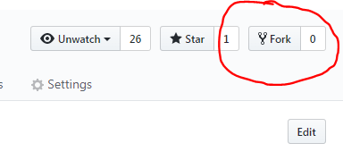

## How to use git

### What is git

### What is git used for

### Create a github account

You will need to create an account on github.com . Make your username something professional! You may keep this account for a long time and use it to show examples of code you've written.

### Install git

Install git on your development computer. You can get it from https://git-scm.com/ . Team laptops will have git already installed and configured the way we want.

When installing select these options:

* Use Git from Git Bash only
* Use the OpenSSL library
* Checkout Windows-style, commit Unix-style line endings
* Use MinTTY

### Fork the repository

In the main page of the repository you want to work on, there will be a Fork button in the upper right. Click it.

