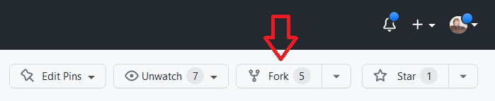
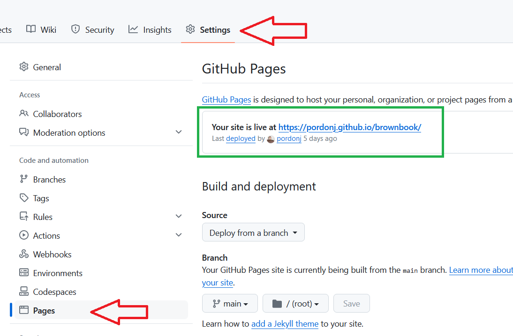
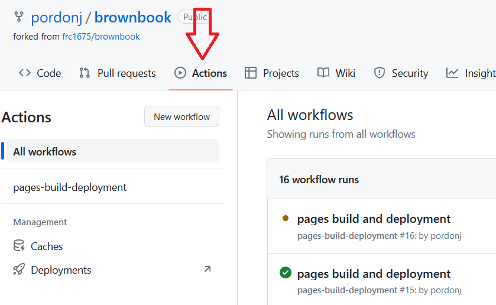
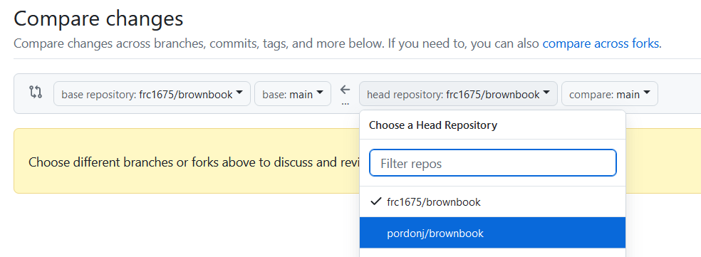

## GitHub for Non-programmers

This guide will take you through contributing to brownbook step-by-step, assuming you have never used GitHub before. It is over-explanatory by design, and takes you from making a GitHub account to making your first pull request with your contributions. It only follows the "happy path" but should not hit any errors. If you get stuck ask the controls team for help!

### Your first contribution

#### Make a GitHub account
Go to [the GitHub homepage](https://github.com) and make an account using the "Sign Up" button in the upper right.

We suggest creating your account with a professional-sounding username - you may use this in the future in your life!

To continue further, contact the controls mentors to get your user account added to the [frc1675](https://github.com/frc1675) organization.

#### Fork brownbook
Next, you will need to **fork**, or make your own copy of, the brownbook repository. You can do this by going to the [brownbook repository page](https://github.com/frc1675/brownbook) and clicking the Fork button in the upper right corner.

Whatever the default options are for the fork should be fine. This will create a brownbook repository under your user and should leave you on its page. You can always get back to it by clicking your picture in the upper right corner and clicking "Your repositories".

#### Set up GitHub pages for your brownbook
Next, we will set up your repository to build and display your repository data as GitHub Pages, just like brownbook does, so you can check your changes as you work.

Go to the Settings tab of your repository and select "Pages" on the left.

Match your settings with those in the picture above - namely "Deploy from a branch" and selecting "master" and "/ (root)". Then click Save.

Go back to the default (Code) tab of your repository and hit the gear in the About section on the left side.

Check the checkbox in this dialog to "Use your GitHub Pages website".

Now the About section will always have a link for you to go directly to your GitHub Pages for your brownbook fork.

#### Open the editor
For any editing beyond small changes in 1 file, we recommend using the GitHub web editor feature.
To open the web editor in GitHub press the `.` (period) key while in your repository.

This will new page which runs a text editor in the cloud for you to use through your browser. It autosaves your changes as you work.

#### Make changes
The content of brownbook is written in Markdown. You can find a guide of how to do Markdown formatting [here](https://docs.github.com/en/get-started/writing-on-github/getting-started-with-writing-and-formatting-on-github/basic-writing-and-formatting-syntax). You can also look at the other files in brownbook for examples or lean on other brownbook contributors to help you get started.

You can make new files and directories using the buttons here near the top of the file list. THe buttons will appear when you mouse over the area or have something selected in the explorer.

You can't cause any (permanent) damage, or any damage to the main brownbook, so feel free to experiment.

#### Preview your changes
Brownbook uses GitHub Pages that are generated from Markdown, but you can preview your files to see how Markdown is formatting them. Click this icon near the top of the editor to see a Markdown preview pane.

#### Stage changes, commit, and push
Once you are happy with some changes they need to be moved into your brownbook repository.

First, the changes need to be **staged**. This is you signifying that you want the changes to be added to your repository. Click the Source Control icon on the left side bar (4th from the top) and the file explorer will go away and show you source control operations.

You can stage each of your files separately or stage them all at once using the menu.

After staging your changes, write a brief descriptive message in the text box above the Commit button. Click the "Commit & Push" button to **commit** all staged changes and **push** them to your repository. Each commit is a set of changes that can easily be reversed or applied to another repository.

Once you have finished you can return to your repository by clicking the menu in the upper left and selecting "Go to Repository".

#### View changes on GitHub Pages
Once your commits are pushed to your brownbook repository, GitHub will process your repository data and generate GitHub Pages. You can watch the progress of this on the Actions tab of your repository page.

It won't take very long. This is what it will look like when the page generation is complete.

Once page generation is complete you can look at your changes in GitHub Pages through the link we set to show on the Code tab of your repository page. Click around, make sure your changes look as you like and that all images and links work correctly.

#### Iterate your changes
Continue through the change, stage, commit, push, check steps until you are happy with your content. Make sure it meets the [brownbook standards](./standards.md)!

#### Make a pull request
The final step is creating a **pull request** to the main brownbook repository. The name sounds backwards because it means you are "requesting" the other repository to pull your changes in.

Go to the [main brownbook repository](https://github.com/frc1675/brownbook), go to the Pull Requests tab at the top, and click the green "New pull request" button on the right of the page.

Your changes are in your fork, so you need to click this link to compare across forks.

Choose your fork to be the head repository.

After selecting your fork, the page should auto-populate with all the changes between your fork and the main brownbook repository. At this point you can click the green button to create the pull request.

It will open a form for your to fill out. Write a title and description for your pull request and click the green button to create it.

You have formally requested your changes be moved into brownbook! At this point some number of brownbook contributors will review your changes, which may need additional changes before being merged in.

