## How to Use Git in VS Code

This guide walks through the tools within VS Code for handling the same terminal git commands we can run from [How to Use Git](./how-to-git.md).

### Key UI features and what we're calling them

#### Branch Indicator

The "Branch Indicator," located at the bottom-left of the main VSCode UI window, tells you the name of the branch you currently have checked out.

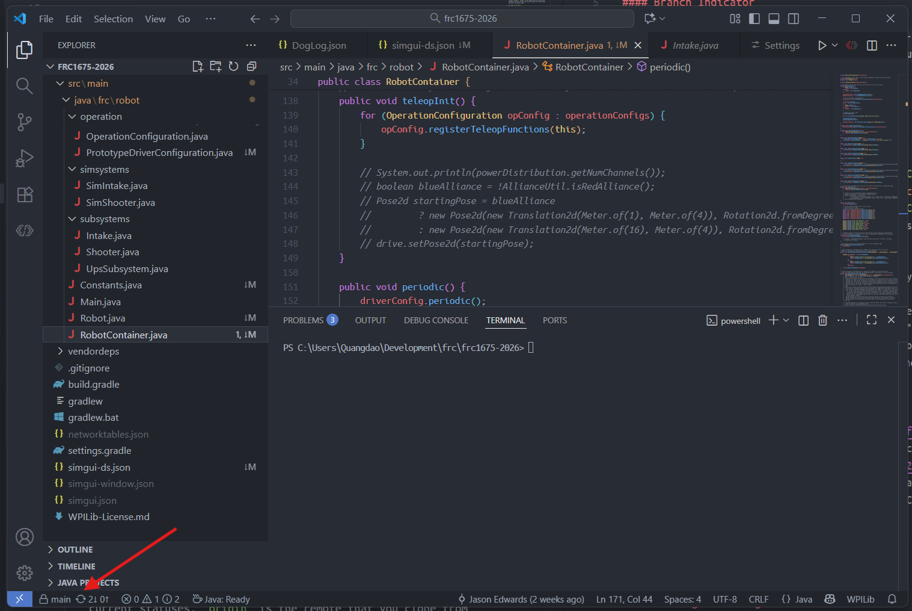

In the example above, we currently have the `main` branch checked out.

This indicator may have different icons:

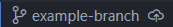  

A cloud with an arrow indicates that your branch is not pushed to GitHub and only exists locally.

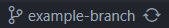  

A "cycling" icon means that the branch is caught up to `origin`! Note that this only means it's only caught up as far as changes your local git is aware of. It's generally a good practice to press it to re-synchronize if you are unsure if you are fully caught up.

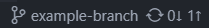  

If you see down and up arrows, there are differences between your local branch and what's in GitHub. The number next to the down arrow shows the number of commits in GitHub that you do not have, and the number next to the up arrow shows the number of unpushed commits you have locally.

#### Source Control Panel

The source control panel is accessible using the left-side navigation. It's the icon that looks like some dots with lines connecting them (labeled 1 below).

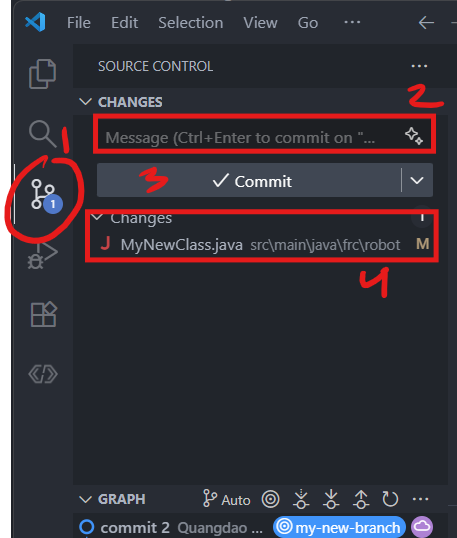

1. Source Control Panel Icon - If you hover over this icon, it will say "Source Control"
2. Message Box - Enter a message here when you are ready to commit your changes
3. Commit Button - Press this button to commit your changes. If no unstaged changes, this will instead switch to a button to push your changes.
4. Changes List - List of changes

### How to do git things

#### First time using the repository

  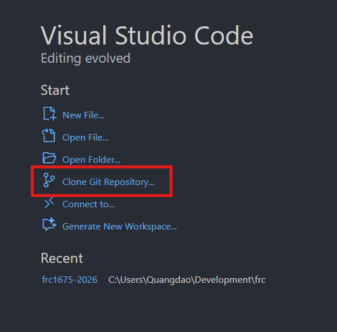

1. Depending on what VS Code looks like when you open it, there are two different ways to clone a new repository.
    1. When you open VSCode for the first time, it will show a "Start" menu. Click on "Clone Git Repository..." →
    2. If you already have a repository or project open, click on the Search bar (with the 🔎) at the top, then type ">clone" and click "Git: Clone" ↓
    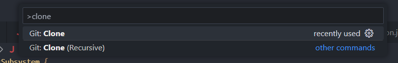
      

2. Click on "Clone from GitHub".
  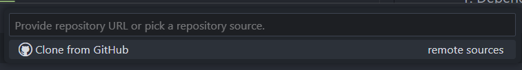
3. Find and click on the repository URL (you can type to search)
  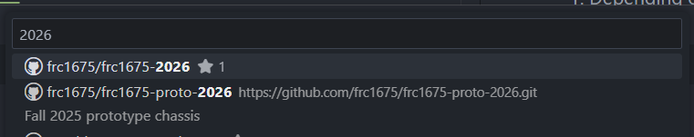
4. Put it in an appropriate folder that you can find. If using a UPS team laptop, put it in `C:/DEV/` (`C:/` is "This PC" -> "Local Disk").

#### When starting a new task

1. Make sure that you are on the `main` branch by checking the [Branch Indicator](#branch-indicator). If it's not, click on the branch name to switch to it.
2. If the you see a cycling icon next to `main`, click on it to pull the `main` branch down from GitHub.
3. Click on `main` again, then click on "Create new branch..."
  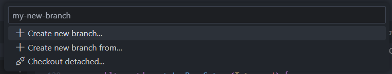
    1. Give your branch an appropriate name

#### Saving your changes to the repository

1. Save all your files
2. Switch to the [Source Control panel](#source-control-panel)
3. Enter a message into the box
  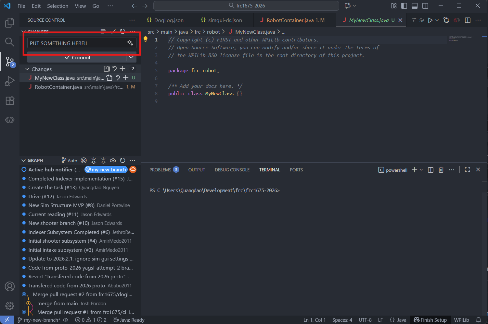
4. Hit "Commit"
5. Depending on if this is a new branch or an existing branch, the "Commit" button will change to say "Publish Branch" or "Sync Changes". Either way, click this button to push your changes to GitHub
   - This is the equivalent `git push origin <branch>` / [sharing your changes to GitHub](./how-to-git.md#sharing-your-changes-on-github)

#### Getting new changes from `main`
