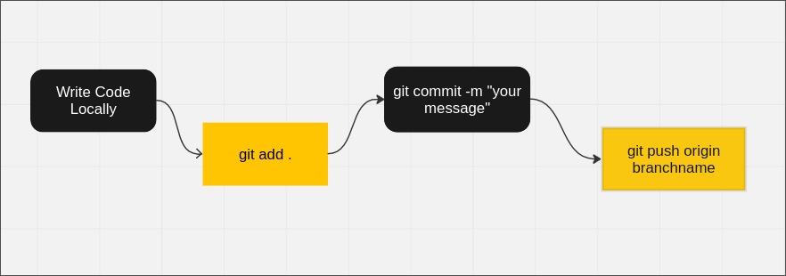
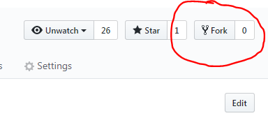

<link rel="stylesheet" href="../../assets/css/git.css">

## What is git and what is it used for? 

Git is something called a content tracker which is capable of cataloging all changes you make to tracked files. Git and other content trackers separate the development of code to be both local and global stages. When you create or edit a file on your computer, the changes you make locally will be recorded and can differ from that of the global codebase. This provides greater quality control to the maintainer and allows for a more adaptable development cycle through quality of life commands such as: "git revert", "git dif." How all of these benefits are achieved is through the implementation of branches. Git centers around the manipulation of branches of code, the merging and converging of existing code to improve 

### How to use git

Commonly Used Commands:
<ul>
    <li>git add %filename%</li>
    The git add command adds a filename to the tracker and its changes will be recorded by git. Only files added through the git add command will be included in commits and pushes later down the line.
    <li>git commit -m %user message%</li>
    The git commit command will record all changes that you make locally on your device. Said commit will be provided a unique code which can be referenced in other commands ie: revert, push, diff. All commits must contain a message, when writing the description try to be as descriptive as possible while also not overwhelming the reviewer.
    <li>git push origin %branchname%</li>
    How we stage changes in most content tracked codebases is through the introduction of new branches containing our code. The git push command takes our locally committed changes and "pushes" them to the external server connected to the repository.
</ul>

For more info, type: <a href="https://git-scm.com/docs">"man git"</a> into your command line. Or watch this <a href="https://www.youtube.com/watch?v=HkdAHXoRtos" >video</a>.

### Create a github account

You will need to create an account on github.com. Make your username something professional! You may keep this account for a long time and use it to show examples of code you've written.

### Install git

Install git on your development computer. You can get it from https://git-scm.com/ . Team laptops will have git already installed and configured the way we want.

When installing select these options:

* Use Git from Git Bash only
* Use the OpenSSL library
* Checkout Windows-style, commit Unix-style line endings
* Use MinTTY

Those are the important ones to make sure, default on every other screen should be fine.

### Fork the repository

In the main page of the repository you want to work on, there will be a Fork button in the upper right. Click it.

Forking creates a personal version of the repo for you to make changes in. Once your changes are made, you will request that the main project take your changed.

### Set up github authentication (Personal laptop)

WIP - see https://help.github.com/articles/set-up-git/

### Clone the repository

