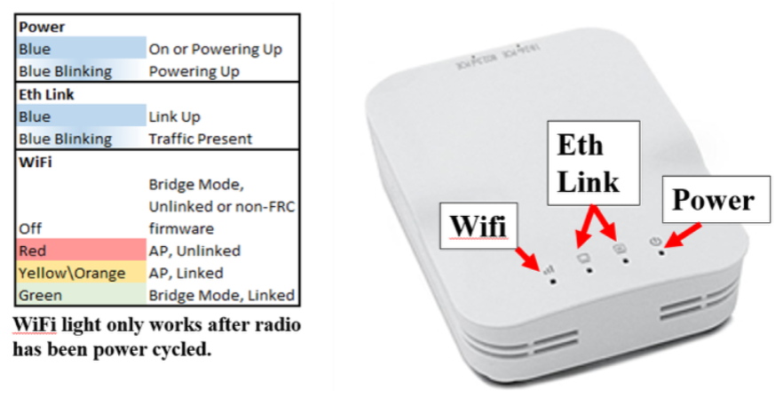

## LED Reference

### Spark MAX

| Mode                 | Color and Pattern |
|----------------------|-------------------|
| Brake (No Signal)    | Cyan Blink        |
| Brake (Valid Signal) | Cyan Solid        |
| Coast (No Signal)    | Magenta Blink     |
| Coast (Valid Signal) | Magenta Solid     |
| Partial Forward      | Green Blink       |
| Full Forward         | Green Solid       |
| Partial Reverse      | Red Blink         |
| Full Reverse         | Red Solid         |
| Forward Limit        | Green/White Blink |
| Reverse Limit        | Red/White Blink   |

### CANCoder

Green light = good. No green light = bad.

### LaserCAN

* Orange: The orange LED should blink rapidly for 2-3 seconds before turning off. If orange LED remains on, upgrade firmware.
* Green: Fully on
* Yellow: Identifying configuration

### Robot Signal Light (RSL)

The RSL state matches the STATUS LED on the RoboRIO when operating normally.

* Solid Orange: Robot on, disabled
* Blinking Orange: Robot on, enabled
* Off: Robot off

### RoboRIO

| LED    | Color/Pattern           | Inference                                                                          |
|--------|-------------------------|------------------------------------------------------------------------------------|
| Power  | Green                   | Power is good                                                                      |
| Power  | Amber                   | Brownout protection tripped, outputs disabled                                      |
| Power  | Red                     | Power fault, check user rails for short circuit                                    |
| Status | 2 blinks                | Software error, reimage roboRIO                                                    |
| Status | 3 blinks                | Safe Mode, restart roboRIO, reimage if not resolved                                |
| Status | 4 blinks                | Software crashed twice without rebooting, restart roboRIO, reimage if not resolved |
| Status | Constant flash or Solid | Unrecoverable error                                                                |
| Radio  |                         | Not currently implemented                                                          |
| Comm   | Off                     | No Communication                                                                   |
| Comm   | Red Solid               | Communication with DS, but no user code running                                    |
| Comm   | Red Blinking            | E-Stop triggered                                                                   |
| Comm   | Green Solid             | Good communication with DS                                                         |
| Mode   | Off                     | Outputs disabled (robot in disabled mode, brownout, etc)                           |
| Mode   | Orange                  | Autonomous enabled                                                                 |
| Mode   | Green                   | Teleop enabled                                                                     |
| Mode   | Red                     | Test enabled                                                                       |

### Limelight

* Green: The green status light will blink slowly if no targets are detected by the current pipeline.
It will blink quickly if any targets are detected by the current pipeline.
* Yellow: The yellow status light will blink when a static IP address has not been assigned. If a
static IP address is assigned, the light will remain either consistently on or off, without any
blinking.

### PDH

| Color/Pattern           | Status                                                 |
|-------------------------|--------------------------------------------------------|
| Blue Solid              | Device on but no communication established             |
| Green Solid             | Main communication with roboRIO established            |
| Magenta Blinking        | Keep-alive timeout                                     |
| Cyan Solid              | Secondary Heartbeat (Connected to REV Hardware Client) |
| Orange/Blue Blinking    | Low Battery                                            |
| Orange/Yellow Blinking  | CAN Fault                                              |
| Orange/Cyan Blinking    | Hardware Fault                                         |
| Orange/Red Blinking     | Failsafe                                               |
| Orange/Magenta Blinking | Device Overcurrent                                     |

### VRM

* 5V/500mA Status LED
  * ON when 5V channels are powered
  * OFF when breaker has tripped
* 12V/500mA Status LED
  * ON when 12V channels are powered
  * OFF when breaker has tripped

### Blinkin

* Blinking blue means that no input PWM active
* Yellow means it entered set up mode. It will turn back to blue after setup mode is exited

### Radio

